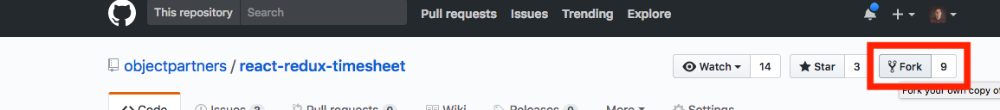
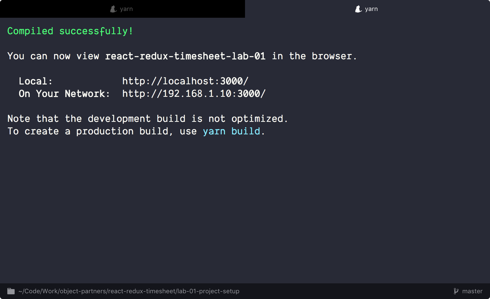
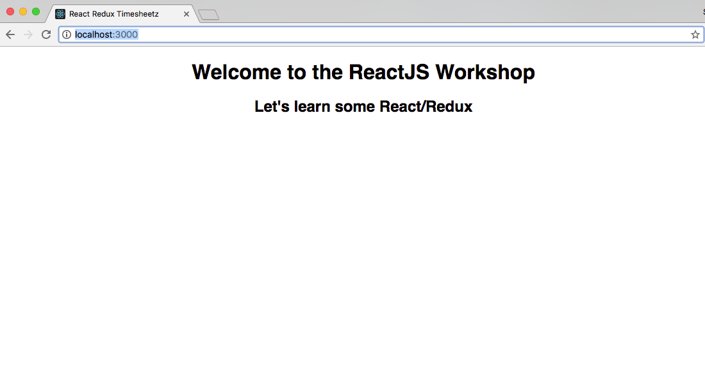

# Lab One - Setup and install dependencies

## Git

Atlassian has a great tutorial for [installing git](https://www.atlassian.com/git/tutorials/install-git)
in various environments. Below are the quick and easy ways.

#### Windows

Install GitBash using the installer [http://git-scm.com/downloads](http://git-scm.com/downloads)
or for more full fledged solution, [git for Windows](https://git-for-windows.github.io/) comes with a GUI
and Windows Explorer integration.

#### Mac

It's probably already installed.

```
$ git --version
git version 2.9.1
```

## Node

Check if you have node installed. `$ node --version`

#### Windows

* Install Node using the installer [https://nodejs.org/en/download/](https://nodejs.org/en/download/
* You may need to install Python 2.7.x+ and Microsoft Visual Studio to build node native libraries.
  * [https://www.python.org/downloads/](https://www.python.org/downloads/)
  * [https://www.visualstudio.com/downloads/](https://www.visualstudio.com/downloads/)
* Restart

#### Mac
* You can download an installer [https://nodejs.org/download/](https://nodejs.org/download/) OR
* Install via Homebrew
  * Check for existing install. `$ brew --version`
  * Install Hombrew as needed [http://brew.sh](http://brew.sh)
  * Install Node w/ Homebrew. `$ brew install node`

## Yarn

* Check if you have yarn installed. `$ yarn --version`
* If Yarn isn't installed, then add it as a global NPM module: `$ npm install -g yarn`

## Checkout the Github repository

Fork project from Github: https://github.com/objectpartners/react-redux-timesheet



then clone the new fork!

```
$ git clone https://github.com/yourusername/react-redux-timesheet.git
```

You should get output similar to below:

```javascript
Cloning into 'react-redux-timesheet'...
remote: Counting objects: 3003, done.
remote: Compressing objects: 100% (1458/1458), done.
remote: Total 3003 (delta 1413), reused 2684 (delta 1256)
Receiving objects: 100% (3003/3003), 1.44 MiB | 1.15 MiB/s, done.
Resolving deltas: 100% (1413/1413), done.
Checking connectivity... done.
```

Change directories to the lab main directory.

```
cd react-redux-timesheet
```

Next we need to make sure our dependencies are installed:

```bash
$ yarn
```

The `final` directory represents the finished state of the application (what we'll have once we've done all of the labs). For each lab, you'll switch to the corresponding directory which will give you a view of the application at the start of that lab. Go ahead and navigate to the `lab-01` directory:

```bash
$ cd lab-01
```

------

Note: these labs technically don't require `yarn` - if you would prefer to use NPM you absolutely can, just replace any references to `yarn` or `yarn install` with `npm install`.
You'll need to install dependencies for each lab individually.

```bash:title=If yarn is not installed...
cd lab-01

npm install
```

## Start the local development server

Run the start script

```
$ yarn start
```



* This kicks off a Node server and serves up our `index.html` page.

* This is a long running process..it only ends on an error--or killing of the server with Ctrl + C

* Open your browser and navigate to [http://localhost:3000](http://localhost:3000)

* Verify that you see the welcome page.



### Troubleshooting

#### Port Conflicts

The labs assume that you don't already have apps running on ports 3000 and 3001. If you do we can override the ports in the following way:

**react-redux-timesheet**
```bash
$ PORT=4000 yarn start
```

**react-redux-api** (used in later labs)
```bash
$ PORT=4001 yarn start
```

Then update the timesheet app to point to that new port and re-launch:

```title=react-redux-timesheet/package.json
"proxy": "http://localhost:4001",
```

#### The CLI apps won't stop with Ctrl-C

Some Windows systems (esp. Windows 10) don't properly pass Ctrl-C to the command line. Some people report that `CTRL-fn-b` works in these situations.
