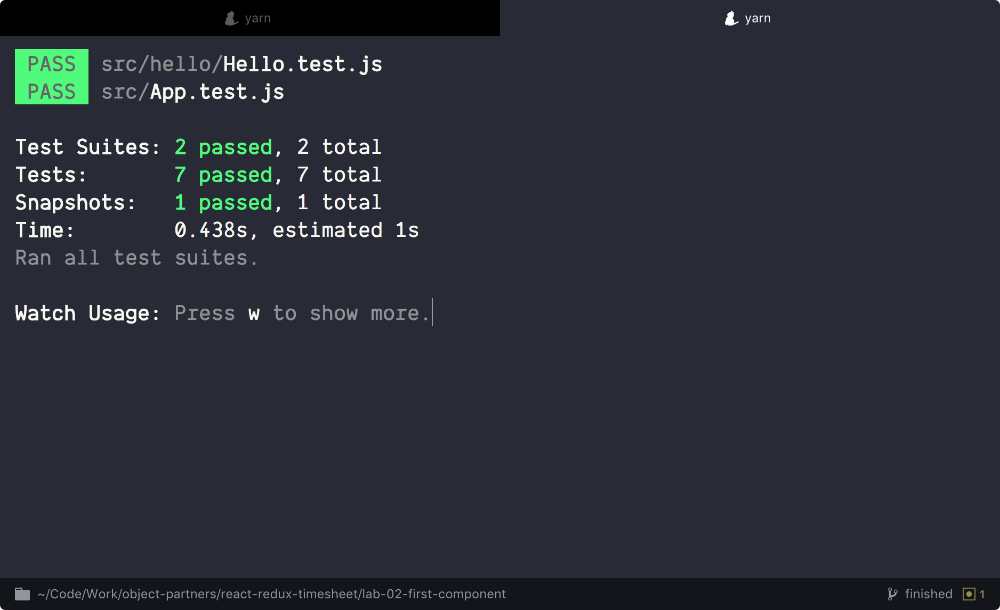
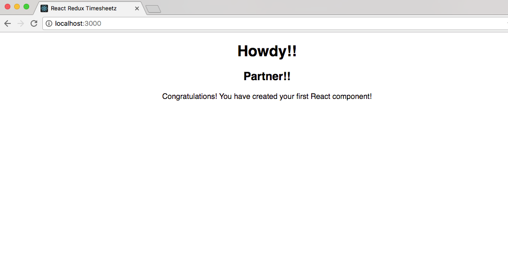
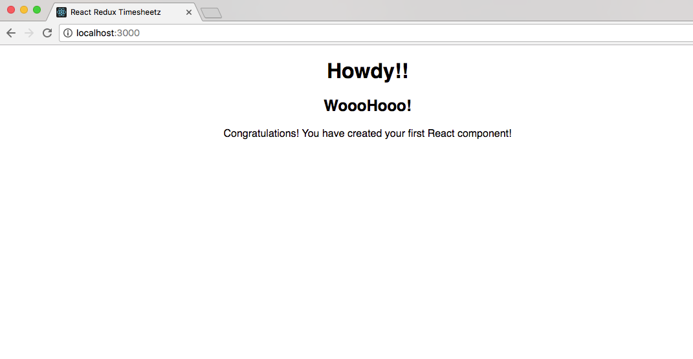

# Lab Two - Your First React Component

## `cd` to the second lab

* In a terminal:

```
cd ../ # presuming still in first lab
cd lab-02-first-component
yarn start
```

## Create the Hello World component

* Open **src/hello/Hello.js**
* This is going to be the component that we will render to the screen.

* The first thing we want to do is `import` **React** and the React **Component** into our module. At the top of the page add:

```javascript:title=src/hello/Hello.js
import React, { Component } from 'react';
```

* Next let's create our empty **React** class and have the module `exports` the class:

```javascript
class Hello extends Component {}

export default Hello;
```

* Now we have to tell **React** what we want the module to draw to the page.
* To do this we need to implement a `render()` method:

* Inside the `class`, add the below method:

```javascript
  render() {
    return (
      <div className="hello">
        <h1>{this.state.greeting}</h1>
        <h2>{this.props.friend}</h2>
        <p>Congratulations!  You have created your first React component!</p>
      </div>
    );
  }
```

* Let's look at what we just did:
  * We've supplied a `JSX` template that adds a couple of headers along with a paragraph.
  * The h1 header is going to display the `greeting` value on the component's state.
  * The h2 header is going to display the value of the `friend` "prop" or attribute passed in by the parent component rendering this component.

- We want to initialize our component with data, so let's give the component a default state.
  * To do this we need to implement `constructor` which will be called by React when initializing the component.
- Add the method below to your component:

```javascript
  constructor(props) {
    super(props);
    this.state = {
      greeting: 'Howdy!!'
    };
  }
```

* Now we need set the default value for the `friend` prop in case the caller doesn't include the attribute in the `JSX`.
  * To do that, we implement `defaultProps` after the class definition and before the export

```javascript
Hello.defaultProps = {
  friend: 'Partner!!',
};
```


&nbsp;


<details>
  <summary>When complete, click here to see what the entire module should look like:</summary>


```javascript
import React, { Component } from 'react';

class Hello extends Component {
  constructor(props) {
    super(props);
    this.state = {
      greeting: 'Howdy!!',
    };
  }

  render() {
    return (
      <div className="hello">
        <h1>{this.state.greeting}</h1>
        <h2>{this.props.friend}</h2>
        <p>Congratulations! You have created your first React component!</p>
      </div>
    );
  }
}

Hello.defaultProps = {
  friend: 'Partner!!',
};

export default Hello;
```


</details>

&nbsp;

## Test the component

* Now that we've created our first component, let's test it to make sure that React can initialize and render it to the DOM.

* Open **src/hello/Hello.test.js**
* First, let's import our libraries for `React` `Hello` and the shallow `enzyme` renderer
* Then, let's set up the Hello World test by adding a suite (describe block):

```javascript:title=src/hello/Hello.test.js
import React from 'react';
import { shallow } from 'enzyme';

import Hello from './Hello';

describe('Hello World:', () => {});
```

* Now we need to set up our components that we'll be testing.

```javascript
it('renders without exploding', () => {
  expect(shallow(<Hello />)).toHaveLength(1);
});

it('should render with default text', () => {
  const component = shallow(<Hello />);

  expect(component).toIncludeText('Howdy');
  expect(component).toIncludeText('Partner');
});

it('should render with our props', () => {
  const component = shallow(<Hello friend="Fred" />);

  expect(component).toIncludeText('Howdy');
  expect(component).toIncludeText('Fred');
  expect(component).not.toIncludeText('Partner');
});
```

> What is happening here? We use the [shallow renderer](http://airbnb.io/enzyme/docs/api/shallow.html) from [Enzyme](http://airbnb.io/enzyme/index.html) to render the component into a sandboxed "document" so that we can perform inquiries. Notice that we are using `JSX` in the `shallow()` method. Shallow testing is useful to isolate our test by not rendering any child components. For more advanced "integration" style tests you would use `mount()` for [full DOM rendering](http://airbnb.io/enzyme/docs/api/mount.html)


&nbsp;


<details>
  <summary>When finished, click here to see if your suite is similar to the one below:</summary>


```javascript
import React from 'react';
import { shallow } from 'enzyme';

import Hello from './Hello';

describe('Hello World:', () => {
  it('renders without exploding', () => {
    expect(shallow(<Hello />)).toHaveLength(1);
  });

  it('should render with default text', () => {
    const component = shallow(<Hello />);

    expect(component).toIncludeText('Howdy');
    expect(component).toIncludeText('Partner');
  });

  it('should render with our props', () => {
    const component = shallow(<Hello friend="Fred" />);

    expect(component).toIncludeText('Howdy');
    expect(component).toIncludeText('Fred');
    expect(component).not.toIncludeText('Partner');
  });
});
```


</details>


&nbsp;


* What are we testing here?:

  * We test that the component successfully renders (if you never test anything else, at least test this)
  * We test that the initial state renders ('Howdy')
  * We test that default props work ('Partner')
  * and that passed-in props work ('Fred')

* If it's not already running, open your terminal and run the test (`yarn test`) command.



* Did your test pass?

* If you get a weird error like the following, try installing watchman as reported here: [watchman bug](https://github.com/facebookincubator/create-react-app/issues/871)

```
Error: Error watching file for changes: EMFILE
    at exports._errnoException (util.js:953:11)
    at FSEvent.FSWatcher._handle.onchange (fs.js:1400:11)
yarn ERR! Test failed.  See above for more details.
```

* There are many more assertions that are possible!
  * Test for a css classname
  * Test component state internal object representation
  * We'll do more testing in upcoming labs, but you can study ahead:
    * [Jest Expect](http://facebook.github.io/jest/docs/expect.html) assertions
    * [Enzyme](http://airbnb.io/enzyme/index.html) testing features
    * [Enzyme Matchers](https://github.com/blainekasten/enzyme-matchers) api

&nbsp;

## Let's render Hello World to the Browser!!

* Open **src/App.js**, and tell **React** to render our component into our app.
  * We first need to import our **Hello** component.
  * We then use the `render()` method to place it on our page:

```javascript:title=src/App.js
import Hello from './hello/Hello';
```

```jsx
  render() {
    return (
      <div className="App">

        <Hello />

      </div>
    );
  }
```

&nbsp;

## Run the application and see your work.

* In a terminal windows run: `yarn start` to fire off the build.
* Navigate to [http://localhost:3000](http://localhost:3000) in your favorite browser.



* Since we didn't set the `friend` prop on our component, the default value is displayed.
* To override it, we just add the prop as an attribute to our JSX in the render method.

```jsx
<Hello friend="WoooHooo!" />
```

* Now refresh the page. The default prop should have been overridden.



&nbsp;

### Commit your changes to Git and get ready for the next lab.

```
git add .
git commit -m 'Lab 2 completed successfully'
```

## Extra Credit

If you're looking for an extra challenge, take a look at [Jest Snapshot testing](http://facebook.github.io/jest/blog/2016/07/27/jest-14.html). On first run, jest will generate a snapshot file that represents the rendered react component in a \_\_snapshots\_\_ folder. On subsequent runs it will compare the test result to the previous snapshot file. On a failure you will have to decide whether to fix the code, modify the test, or press 'u' to update the snapshot file with the new rendering.

Snapshot testing can save you time from writing individual expect assertions on elements, by simply allowing you to review the snapshot file on any changes.

Try creating a Snapshot test inside Hello.test.js, or:

<details><summary>Click here for an example Hello.test.js test</summary><p>

```jsx
import renderer from 'react-test-renderer';

it('should render to match the snapshot', () => {
  const component = renderer.create(<Hello friend="Luke" />);

  expect(component.toJSON()).toMatchSnapshot();
});
```

</p></details>
<br/>

* Now take a look at the generated \_\_snapshots\_\_/Hello.test.js.snap file to see what the rendered Hello component looks like
* Modify the test "friend" attribute to a different name
* See that the test now fails
* Update the snapshot to match the updated test
* re-run the tests and see that they are all passing

`git add .` and `git commit -m "extra credit"` when you are done

## Extra Extra Credit

Modify the App.test.js file to test for the rendering of the `Hello` component that we added to App.js.

Don't forget to `git add .` and `git commit -m "extra extra credit"` when you are done
