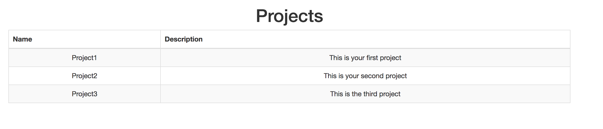

# Lab Two - Your First React Component

## Switch to Lab02

* In a terminal:

```
cd ../ # presuming still in previous lab
cd lab-02
yarn start
```

## What are we trying to do?

The first thing we need in our Timesheet application is a listing of all the projects that an employee can be working on. We want a table with one row for each Project.

Many times in React it's helpful to build things starting at the bottom and building your way upwards - we're going to do this here by building a row, then a table, then a container.

## Create a component that will render a Project row

* Open **src/projects/ProjectRow.js**
* This is going to be the component that will render a single row in our table using data from a Project

* The first thing we want to do is `import` the libraries we need. At the top of the page add:

```javascript:title=src/projects/ProjectRow.js
import React from 'react';
import PropTypes from 'prop-types';
```

* This imports the React library so we can create React logic, and the PropTypes library so we can define the types of properties our React logic expects.

* Next let's create our empty **React** component class and have the module `export` the class:

```javascript
class ProjectRow extends React.Component {
  
}

export default ProjectRow;
```

* Now we have to tell **React** what we want the component to draw to the page.
* To do this we need to implement a `render()` method:

* Inside the `class`, add the below method:

```javascript
  render() {
    const { project } = this.props;
    
    return (
      <tr>
        <td>{project.name}</td>
        <td>{project.description}</td>
      </tr>
    );
  }
```

* Let's look at what we just did:
  * We've grabbed a 'project' prop that we presume will be supplied to this component from a parent
  * We've supplied a `JSX` template that builds an HTML table row along with a couple table cells
  * The first cell is going to display the 'name' value off the project
  * The second cell is going to display the 'description' value off the project

* Next we declare that this component expects a single prop named 'project'. Add this just above the default export:

```javascript
ProjectRow.propTypes = {
  project: PropTypes.object.isRequired
};
```

<details>
  <summary>When complete, click here to see what the entire module should look like:</summary>


```javascript
import React from 'react';
import PropTypes from 'prop-types';

class ProjectRow extends React.Component {
  render() {
    const { project } = this.props;

    return (
      <tr>
        <td>{project.name}</td>
        <td>{project.description}</td>
      </tr>
    );
  }
}

ProjectRow.propTypes = {
  project: PropTypes.object.isRequired
};

export default ProjectRow;
```


</details>

&nbsp;

## Create a table component

* We have a row, but now we need a way to turn a list of projects into a table full of `ProjectRow` components
* Open **src/projects/ProjectTable.js**

* Add the necessary imports:

```javascript:title=src/projects/ProjectTable.js
import React from 'react';
import PropTypes from 'prop-types';
import { Table } from 'react-bootstrap';
import ProjectRow from './ProjectRow';
```

* You'll notice we're pulling in two new imports:
  * We're going to use a `Table` component from a third-party library called `react-bootstrap` - this is just to make things look pretty
  * We're going to use our `ProjectRow` component for each Project we want to render in our table

* Declare our base class and export

```javascript

class ProjectTable extends React.Component {
}

export default ProjectTable;
```

* Then build a render method to construct a table from a list of projects:

```javascript
render() {
  const { projects } = this.props;

  return (
    <Table bordered striped>
      <thead>
        <tr>
          <th>Name</th>
          <th>Description</th>
        </tr>
      </thead>
      <tbody>
        {projects.map(project => (
          <ProjectRow project={ project } key={ project._id }/>
        ))}
      </tbody>
    </Table>
  );
}
```

* Whoa! This is *way* more complicated than the last one! What's going on here?
  * We grab a list of projects that we presume will be supplied as a prop
  * We build a `Table` and set some props to enable some Bootstrap-supplied styling ('bordered' adds a border, 'striped' causes alternating rows to be different colors)
  * We give that table a header in which we define the column headings
  * Inside the table body we then iterate over the list of projects and, for each, map a project to an instance of our `ProjectRow` component. We pass the project down as a prop.
  **Note:** We're also giving React an 'index' in the form of `key` so it can efficiently render the list of items

* Finally, add our prop declarations:

```javascript
ProjectTable.defaultProps = {
  projects: []
};

ProjectTable.propTypes = {
  projects: PropTypes.array
};
```


<details>
  <summary>When complete, click here to see what the entire module should look like:</summary>


```javascript
import React from 'react';
import PropTypes from 'prop-types';
import { Table } from 'react-bootstrap';
import ProjectRow from './ProjectRow';

class ProjectTable extends React.Component {
  render() {
    const { projects } = this.props;

    return (
      <Table bordered striped>
        <thead>
          <tr>
            <th>Name</th>
            <th>Description</th>
          </tr>
        </thead>
        <tbody>
          {projects.map(project => (
            <ProjectRow project={ project } key={ project._id }/>
          ))}
        </tbody>
      </Table>
    );
  }
}

ProjectTable.defaultProps = {
  projects: []
};

ProjectTable.propTypes = {
  projects: PropTypes.array.isRequired
};

export default ProjectTable;
```


</details>

&nbsp;

## Create a component to manage the data

* Awesome! We have a component that will display a table full of project data. But where does the data come from?
* It's typically best practice to separate out how you show your data (present) vs. manage your data (contain) - we'll talk more about this when we get to Redux
* Let's build a data container

* Open **src/projects/Projects.js**
* This is going to be the component that will hold the Project data and pass it down into the table

* Add the necessary imports:

```javascript:title=src/projects/Projects.js
import React from 'react';
import ProjectTable from './ProjectTable';
```

* And build the base class

```javascript
class Projects extends React.Component {
  
}

export default Projects;
```

* Now we need to give the component some data to render. A good holding place is the component's *state*. We need to initialize state with the data in the state property. Add this property at the top of the class:

```javascript
state = {
  projects: [
    {
      _id: 1,
      name: 'Project1',
      description: 'This is your first project'
    },
    {
      _id: 2,
      name: 'Project2',
      description: 'This is your second project'
    },
    {
      _id: 3,
      name: 'Project3',
      description: 'This is the third project'
    }
  ]
};
```

* Now we have to get that data into our table
* Add the render method:

```javascript
  render() {
    const { projects } = this.state;
  
    return (
      <div>
        <h1>Projects</h1>
        <ProjectTable projects={projects} />
      </div>
    );
  }
```


<details>
  <summary>When complete, click here to see what the entire module should look like:</summary>


```javascript
import React from 'react';
import ProjectTable from './ProjectTable';

class Projects extends React.Component {
  state = {
    projects: [
      {
        _id: 1,
        name: 'Project1',
        description: 'This is your first project'
      },
      {
        _id: 2,
        name: 'Project2',
        description: 'This is your second project'
      },
      { _id: 3, name: 'Project3', description: 'This is the third project' }
    ]
  };

  render() {
    const { projects } = this.state;

    return (
      <div>
        <h1>Projects</h1>
        <ProjectTable projects={projects} />
      </div>
    );
  }
}

export default Projects;
```


</details>

&nbsp;

## Test our components

* Now that we've created our first components, we need to make sure they work as expected

* Open **src/projects/ProjectRow.test.js**
* First, let's import our libraries for `React` `ProjectRow` and the shallow `enzyme` renderer
* Then, let's set up the test suite by adding a `describe` block:

```javascript:title=src/projects/ProjectRow.test.js
import React from 'react';
import { shallow } from 'enzyme';

import ProjectRow from './ProjectRow';

describe('<ProjectRow />', () => {
  // Tests go here
});
```

* Now we need to set up our component that we'll be testing. Inside the `describe` block:

```javascript
let wrapper;

beforeEach(() => {
  const project = {
    name: 'NAME',
    description: 'DESCRIPTION'
  };
  wrapper = shallow(<ProjectRow project={project} />);
});
```

> What is happening here? We use the [shallow renderer](http://airbnb.io/enzyme/docs/api/shallow.html) from [Enzyme](http://airbnb.io/enzyme/index.html) to render the component into a in-memory sandboxed "document" so that we can perform inquiries. Notice that we are using `JSX` in the `shallow()` method. Shallow testing is useful to isolate our test by not rendering any child components. For more advanced "integration" style tests you would use `mount()` for [full DOM rendering](http://airbnb.io/enzyme/docs/api/mount.html)

* The shallow render is going to be created before each test we define. This may seem inefficient (why not just create it once?), but shallow renders are very fast and starting with a blank slate before each test can be helpful once your tests get complicated.
* This is great, but we aren't actually testing anything yet. Let's add some tests below the `beforeEach` block:

```javascript
it('should instantiate the Project Row Component', () => {
  expect(wrapper).toHaveLength(1);
});

it('should render values into expected cells', () => {
  expect(wrapper.find('td')).toHaveLength(2);
  expect(wrapper.find('td').at(0).text()).toEqual('NAME');
  expect(wrapper.find('td').at(1).text()).toEqual('DESCRIPTION');
});
```

* Our tests first verify that the ProjectRow component renders without blowing up (always a good test to have 😅), then tests that the expected values are rendered into the table cells


&nbsp;


<details>
  <summary>When finished, click here to see if your suite is similar to the one below:</summary>


```javascript
import React from 'react';
import { shallow } from 'enzyme';

import ProjectRow from './ProjectRow';

describe('<ProjectRow />', () => {
  let wrapper;

  beforeEach(() => {
    const project = {
      name: 'NAME',
      description: 'DESCRIPTION'
    };
    wrapper = shallow(<ProjectRow project={project} />);
  });

  it('should instantiate the Project Row Component', () => {
    expect(wrapper).toHaveLength(1);
  });

  it('should render values into expected cells', () => {
    expect(wrapper.find('td')).toHaveLength(2);
    expect(wrapper.find('td').at(0).text()).toEqual('NAME');
    expect(wrapper.find('td').at(1).text()).toEqual('DESCRIPTION');
  });
});
```


</details>


&nbsp;

* Let's write tests for ProjectTable. Open **src/projects/ProjectTable.test.js**

```javascript
import React from 'react';
import { shallow } from 'enzyme';

import ProjectTable from './ProjectTable';
import ProjectRow from './ProjectRow';

describe('<ProjectTable />', () => {
  let wrapper;

  beforeEach(() => {
    const projects = [{}, {}];
    wrapper = shallow(<ProjectTable projects={projects} />);
  });

  it('should instantiate the Project Table Component', () => {
    expect(wrapper).toHaveLength(1);
  });

  it('should render a row for each project', () => {
    expect(wrapper.find(ProjectRow)).toHaveLength(2);
  });
});
```

* These tests shallow render ProjectTable with two stubbed project entries
  * We verify that the table renders without blowing up
  * Then make sure that we end up with two instances of the ProjectRow component being rendered (one for each project entry)

* Finally, add some tests for Projects. Open **src/projects/Projects.test.js**

```javascript
import React from 'react';
import { shallow } from 'enzyme';

import Projects from './Projects';
import ProjectTable from './ProjectTable';

describe('<Projects />', () => {
  let wrapper;

  beforeEach(() => {
    wrapper = shallow(<Projects />);
  });

  it('should instantiate the Project Component', () => {
    expect(wrapper).toHaveLength(1);
  });

  it('should pass projects down to table', () => {
    wrapper.setState({
      projects: [{}, {}, {}, {}]
    });
    expect(wrapper.find(ProjectTable).prop('projects')).toHaveLength(4);
  });
});
```

* Here, we're shallow rendering the Projects container
  * First we ensure it renders
  * Then we use Enzyme to update the component's state so that it has 4 project entries, then verify that the prop value passed down to ProjectTable reflects those 4 items


* If it's not already running, open your terminal and run the test (`yarn test`) command.


* Did your tests pass?

* If you get a weird error like the following, try installing watchman as reported here: [watchman bug](https://github.com/facebookincubator/create-react-app/issues/871)

```
Error: Error watching file for changes: EMFILE
    at exports._errnoException (util.js:953:11)
    at FSEvent.FSWatcher._handle.onchange (fs.js:1400:11)
yarn ERR! Test failed.  See above for more details.
```

* There are many more assertions that are possible!
  * Test for a css classname
  * Test component state internal object representation
  * We'll do more testing in upcoming labs, but you can study ahead:
    * [Jest Expect](http://facebook.github.io/jest/docs/expect.html) assertions
    * [Enzyme](http://airbnb.io/enzyme/index.html) testing features
    * [Enzyme Matchers](https://github.com/blainekasten/enzyme-matchers) api

&nbsp;

## Let's render our Projects table to the Browser!!

* Open **src/App.js**, and tell **React** to render our component into our app.
  * We first need to import our **Projects** component.
  * We then use the `render()` method to place it on our page:

```javascript:title=src/App.js
import Projects from './projects/Projects';
```

```jsx
  render() {
    return (
      <div className="App">
        <div className="container">
          <Projects />
        </div>
      </div>
    );
  }
```

&nbsp;

* How does React get rendered?
  * **App.js** is what we're treating as our root component - the base piece of React that encompasses our entire SPA
  * Take a look at **src/index.js** - this JavaScript is run at load time (our Webpack setup makes this file the "entrypoint" of our application). It takes the `App` component and renders it into a DOM node with an id of "root". This is how React gets bootstrapped.

## Run the application and see your work.

* In a terminal window run: `yarn start` to fire off the build.
* Navigate to [http://localhost:3000](http://localhost:3000) in your favorite browser (if it doesn't automatically open)



&nbsp;

### Commit your changes to Git and get ready for the next lab.

```
git add .
git commit -m "Lab 2 completed successfully"
```

## Extra Credit

If you're looking for an extra challenge, take a look at [Jest Snapshot testing](http://facebook.github.io/jest/blog/2016/07/27/jest-14.html). On first run, jest will generate a snapshot file that represents the rendered react component in a \_\_snapshots\_\_ folder. On subsequent runs it will compare the test result to the previous snapshot file. On a failure you will have to decide whether to fix the code, modify the test, or press 'u' to update the snapshot file with the new rendering.

Snapshot testing can save you time from writing individual expect assertions on elements, by simply allowing you to review the snapshot file on any changes. It also serves as a useful "tripwire" to inform developers that they may have impacted components/logic they didn't intend to.

Try creating a Snapshot test inside ProjectRow.test.js, or:

<details>
<summary>Click here for an example ProjectRow.test.js test</summary>


```jsx
it('should render to match the snapshot', () => {
  expect(wrapper).toMatchSnapshot();
});
```


</details>

&nbsp;

* Now take a look at the generated \_\_snapshots\_\_/ProjectRow.test.js.snap file to see what the rendered ProjectRow component looks like
* Modify one of the project attributes to a different value
* See that the test now fails
* Update the snapshot to match the updated test
* re-run the tests and see that they are all passing

`git add .` and `git commit -m "extra credit"` when you are done

