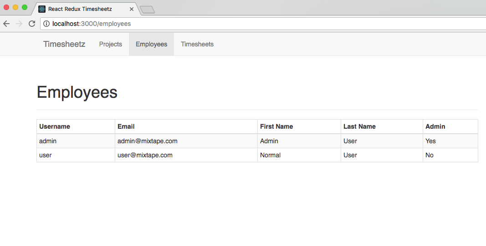

# Lab Three - Routing and Components

## Switch to the Lab03 branch

* In a terminal:

```
git checkout lab-03
yarn start
```

### Check it out!

* While we were working on the last lab, the rest of the team was adding lots of new stuff to the app
* Before proceeding, let's look at the progress that has been made:
  * Peruse the **src/components** directory and notice that the **Projects** and **Timesheets** modules have been implemented by the team.
  * You will be building out the **Employees** module and adding **Navigation** to the app.
  * The module files have been stubbed out for you, we just need to add the logic.

&nbsp;

## Creating our Application's Routes

* Open **src/App.js**
* Let's start by importing the component classes that we're going to use as the **Handlers** for our routes:

```javascript:title=src/App.js
import Projects from './components/projects/Projects';
import Employees from './components/employees/Employees';
import Timesheets from './components/timesheets/Timesheets';
```

* Next we'll import some classes from the react router

```javascript
import { BrowserRouter, Route, Switch, Redirect } from 'react-router-dom';
```

* Next let's configure our routes:
  * We need to wrap the routes in a **BrowserRouter** to handle the routes
  * We need separate sibling routes for **Projects**, **Employees**, and **Timesheets**.
  * If we can't match a route, we want to redirect the user to the **Employees** component.

```jsx
  render() {
    return (
      <BrowserRouter>
        <div className="App">
          <Switch>
            <Route path="/projects" component={Projects}/>
            <Route path="/employees" component={Employees}/>
            <Route path="/timesheets" component={Timesheets}/>
            <Redirect to="/employees"/>
          </Switch>
        </div>
      </BrowserRouter>
    );
  }
```

* Finally, let's add the Navigation component while we're here.
  * Let's import the **Navigation** component - Then add the component in side the "App" div


<details>
  <summary>Click here to see the finished class:</summary>


```javascript
import React from 'react';
import './App.css';
import Projects from './components/projects/Projects';
import Employees from './components/employees/Employees';
import Timesheets from './components/timesheets/Timesheets';
import Navigation from './components/nav/Navigation';
import { BrowserRouter, Route, Switch, Redirect } from 'react-router-dom';

class App extends React.Component {
  render() {
    return (
      <BrowserRouter>
        <div className="App">
          <Navigation />
          <Switch>
            <Route path="/projects" component={Projects} />
            <Route path="/employees" component={Employees} />
            <Route
              path="/timesheets"
              component={Timesheets}
            />
            <Redirect to="/employees" />
          </Switch>
        </div>
      </BrowserRouter>
    );
  }
}

export default App;
```


</details>


&nbsp;

## Add the Navbar to our Application

* Open **src/components/nav/Navigation.js**

* We first need to import the Bootstrap components that we are going to use
* Also the **LinkContainer** from the react-router-bootstrap library that helps us integrate the router with bootstrap

```javascript:title=src/components/nav/Navigation.js
import { Navbar, Nav, NavItem } from 'react-bootstrap';
import { LinkContainer } from 'react-router-bootstrap';
```

* Now we can implement our `render()` method:

```javascript
  render() {
    return (
      <Navbar>
        <Navbar.Header>
          <Navbar.Brand>
            Timesheetz
          </Navbar.Brand>
        </Navbar.Header>
        <Nav>
          <LinkContainer to="/projects">
            <NavItem eventKey={1}>Projects</NavItem>
          </LinkContainer>
          <LinkContainer exact to="/employees">
            <NavItem eventKey={3}>Employees</NavItem>
          </LinkContainer>
          <LinkContainer to={`/employees/${this.state.user._id}/timesheets`}>
            <NavItem eventKey={2}>Timesheets</NavItem>
          </LinkContainer>
        </Nav>
      </Navbar>
    );
  }
```

&nbsp;

## Test the Navbar

* Just like in lab 2, we need to test that our component will render without errors.
* Open **src/components/nav/Navigation.test.js** and add the test suite.

* Add the below code to the **Navigation.test.js**
  > Note that we need to wrap the Navigation in a **BrowserRouter**, so we use `mount` to render the nested Navigation element here

```javascript:title=src/components/nav/Navigation.test.js
let nav;

beforeEach(() => {
  nav = mount(
    <BrowserRouter>
      <Navigation />
    </BrowserRouter>
  );
});

it('should instantiate the Navigation Component', () => {
  expect(nav).toHaveLength(1);
});
```

&nbsp;

## Run the tests

* Run `yarn test` and verify that all the tests pass.
  * Since the rest of your team has already implemented a bunch of tests, you may have to do a little searching to find the tests you just wrote.

&nbsp;

## Run the application and see your work.

If you haven't already done so,

* In a terminal window run: `yarn start` to fire off the build.
* Navigate to [http://localhost:3000](http://localhost:3000) in your favorite browser.
* You should be able to click around the navbar and see the routes change.
  * I'm sure it worked fine for **Timesheets** and **Projects**, but we still need to implement **Employees**.

&nbsp;

## Composing React Components

* Now that we have functional routing between our three sections of the application, we need to finish the **Employee** module.

* We want to display the list of employees when the user clicks the employee link in the navbar.
* To do this, we need to build three components:
  * The _Employees_ route handler that acts as our controller component.
  * The _EmployeeTable_ component to contain our list of employees.
  * The _EmployeeRow_ component that is repeated within our _EmployeeTable_ component for each employee.

&nbsp;

## Create the EmployeeRow Component

* Open **src/components/employees/EmployeeRow.js**
* We need to create a component that accepts an employee property (which is an object).
* The row should contain `<td/>`'s for each of the employee's properties.
* Add the following to your EmployeeRow React class

```javascript:title=src/components/employees/EmployeeRow.js
  render() {
    const employee = this.props.employee;

    return (
      <tr>
        <td>{employee.username}</td>
        <td>{employee.email}</td>
        <td>{employee.firstName}</td>
        <td>{employee.lastName}</td>
        <td>{employee.admin ? 'Yes' : 'No'}</td>
      </tr>
    );
  }
```

* Now, we need to test that our component renders correctly.
* Open **src/components/employees/EmployeeRow.test.js** and add the tests below.
  * Feel free to add actual properties to the employee object and test for their existence in a `<td/>`.

```javascript:title=src/components/employees/EmployeeRow.test.js
it('should instantiate the Employee Table', () => {
  const employee = {
    username: 'fflintstone',
    email: 'fred.flintstone@slatequarry.com',
    firstName: 'Fred',
    lastName: 'Flintstone',
    admin: true,
  };

  const component = shallow(<EmployeeRow employee={employee} />);

  expect(component).toContainReact(<td>Flintstone</td>);
  expect(component).toContainReact(<td>fflintstone</td>);
  expect(component).toContainReact(<td>Yes</td>);
});
```

* Run the tests. Did your new one pass?

## Create the EmployeeTable Component

* Our next move is to create the table that will contain our **EmployeeRow**s.
* Open **src/components/employees/EmployeeTable.js**
* First we need to implement our `render()` method that:
  * Iterates through the list of employees and instantiates a new **EmployeeRow** for each employee.
  * Collect all the rows into a variable and add that variable to the table body.

```javascript:title=src/components/employees/EmployeeTable.js
  render() {
    return (
      <Table bordered striped>
        <thead>
          <tr>
            <td>Username</td>
            <td>Email</td>
            <td>First Name</td>
            <td>Last Name</td>
            <td>Admin</td>
          </tr>
        </thead>
        <tbody>
          {employees.map(employee => (
            <EmployeeRow employee={ employee } key={ employee._id }/>
          ))}
        </tbody>
      </Table>
    );
  }
```

* We need to declare that the **employees** property should be an array of objects and that it is required.
* We'll also set the default value to an empty array

```javascript
EmployeeTable.defaultProps = {
  employees: []
};

EmployeeTable.propTypes = {
  employees: PropTypes.array.isRequired
};
```

* Now let's test that our employee table renders correctly.
* Can you write a test to check the number of **EmployeeRows** added to our table?
* Open **src/components/employees/EmployeeTable.test.js**
* Add the following to the **Employee Table Component** suite:

```javascript:title=src/components/employees/EmployeeTable.test.js
it('should instantiate the Employee Table', () => {
  const employees = [
    {
      username: 'fflintstone',
      email: 'fred.flintstone@slatequarry.com',
      firstName: 'Fred',
      lastName: 'Flintstone',
      admin: true,
      _id: 1,
    },
  ];

  const component = mount(<EmployeeTable employees={employees} />);

  expect(component).toContainReact(<th>Last Name</th>);
  expect(component).toIncludeText('Flintstone');

  expect(component.find('tbody tr')).toHaveLength(1);
});
```

* Run the tests. Did your new one pass?

&nbsp;

## Create Employees Component

* Last, we need to add the table to our handler for the `/employees` route.
* Open **src/components/employees/Employees.js**
* Add the imports for the **EmployeeTable** as well as the **PageHeader, Grid, and Row** from react-bootstrap

```javascript:title=src/components/employees/Employees.js
import EmployeeTable from './EmployeeTable';
```

* Add the render method below to the React class

> The component's `constructor` has been implemented for you so that you'll have mock data.

```javascript
  render() {
    return (
      <div>
        <h1>Employees</h1>
        <EmployeeTable employees={ employees }/>
      </div>
    );
  }
```

* Open **src/components/employees/Employees.test.js**
* Test that our component renders as expected.
* Add the code below to the **Employees Component** suite

```javascript:title=src/components/employees/Employees.test.js
it('should instantiate the Employee Component', () => {
  const component = shallow(<Employees />);

  expect(component).toHaveLength(1);
});

it('should contain a correct employee', () => {
  const component = mount(<Employees />);

  expect(component).toIncludeText('admin@mixtape.com');
});
```

* Run the tests. Did your new one pass?

## Run the application and see your work.

If you haven't already done so,

* In a terminal windows run: `yarn start` to fire off the build.
* Navigate to [http://localhost:3000](http://localhost:3000) in your favorite browser.

* Click around and enjoy the result of your hard work during this lab.



&nbsp;

### Commit your changes to Git and get ready for the next lab.

```
git add .
git commit -m 'We added some routes'
```
