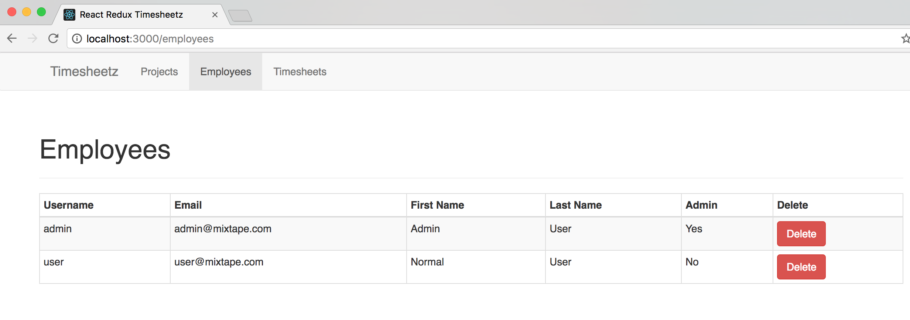
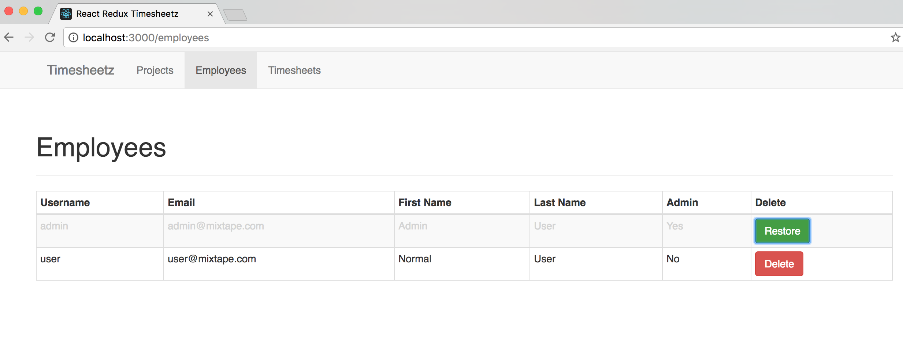

# Lab Four - Integrating Redux

## Switch to Lab04

* In a terminal:

```
cd ../ # presuming still in previous lab
cd lab-04
yarn start
```

### Check it out!

* While we were working on the last lab, the rest of the team was adding lots of new stuff to the app
* Before proceeding, let's look at the progress that has been made:
  * Peruse the **src** directory and notice that there's a new **Timeunits** module. This will track time entries in a Timesheet
  * It has been hooked up to Redux already. Some parts of **src/timeunits/Timeunits.js** may sound familiar from the lecture - `connect`, `mapDispatchToProps`, `mapStateToProps` for example
  * The team has implemented **actions** and **reducers** for large parts of the app. Take a look at those directories to get a feel for how these items are laid out and used.
  * Finally, look at the **src/index.js**, **src/reducers/index.js** and **src/store/configure-store.js** to see how we instantiated Redux and included it in our app.
  * Don't worry if it looks a little cryptic - by the end of this lab you will have a better understanding of what is happening.

- What will we do?
  * We want to replace our use of static data with loading data dynamically using Rest service calls. To do this we'll need a way to retrieve all employees and retrieve a single employee.
  * We will be building our **EmployeeActionCreator** and our **employee-reducer**.
  * Next we will add our reducer to the **rootReducer** and connect our state and actions to our **Employees** component
  * Then we will update our **Employees** components to use our actions to retrieve our list of employees.
  * Finally, we will update our **EmployeeRow** to delete/restore employees using the actions we created.

&nbsp;

### Create the Employee Action Types

* Open **src/actions/EmployeeActionTypes.js**
* Let's add the constants for the list and get actions.

```js:title=src/actions/EmployeeActionTypes.js
export const LIST = 'LIST_EMPLOYEES';
export const GET = 'GET_EMPLOYEE';
```

&nbsp;

### Create the Employee Actions

* Redux Thunk typically works this way:
  - A trigger (usually user activity, but could be an expiring timer, etc) will execute an asynchronous method
  - The method will execute whatever logic is necessary to complete the activity flow (getting data, updating data, etc). Typically this involves making Rest service calls.
  - Any results of the activity that the application state must respond to (changing values in Redux State) are communicated by dispatching an action. A single asynchronous method may generate 0 to many actions.
  - A common pattern is for an action will be dispatched when a service call is starting so a loading indicator can be activated and when the service call completes (either successfully or unsuccessfully) so the indicator can be stopped
  - In our examples here we're only dispatching actions at the end of each activity to inform the application when new data has been retrieved - to retain simplicity we aren't using loading indicators so we dispense with those actions 

* Now open **src/actions/EmployeeActionCreator.js** so we can create the actions.
* We'll import the types we just created, and the [Axios](https://github.com/mzabriskie/axios) library to handle our http requests.

```javascript:title=src/actions/EmployeeActionCreator.js
import * as EmployeeActionTypes from './EmployeeActionTypes';
import Axios from 'axios';
```

* Now let's implement the functions that will be used to update the state of our application.

```javascript
export const list = employees => {
  return {
    type: EmployeeActionTypes.LIST,
    employees: employees,
  };
};

export const get = employee => {
  return {
    type: EmployeeActionTypes.GET,
    employee: employee,
  };
};
```

* Next we'll implement the asynchronous methods that will be used to make our http Requests, along with a helper method to build the url.

```javascript
const apiUrl = '/api/users';

const url = employeeId => {
  if (employeeId) {
    return `${apiUrl}/${employeeId}`;
  }
  return apiUrl;
};

export const listEmployees = () => {
  return dispatch => {
    return Axios.get(url())
      .then(response => {
        dispatch(list(response.data));
        console.log('Employees retrieved.');
      })
      .catch(error => {
        console.log('Error attempting to retrieve employees.', error);
      });
  };
};

export const getEmployee = id => {
  return dispatch => {
    return Axios.get(url(id))
      .then(res => {
        dispatch(get(res.data));
        return true;
      })
      .catch(error => {
        console.log('There was an error getting the employee');
      });
  };
};

export const updateEmployee = employee => {
  return dispatch => {
    return Axios.put(url(employee._id), employee)
      .then(res => {
        dispatch(get(res.data));
        console.log(`Employee : ${employee._id}, updated.`);
        return true;
      })
      .catch(error => {
        console.log('There was an error updating employee.');
      });
  };
};

export const removeEmployee = employee => {
  return dispatch => {
    employee.deleted = true;

    return Axios.put(url(employee._id), employee)
      .then(res => {
        dispatch(get(res.data));
        console.log(`Employee : ${res.data._id}, was deleted.`);
        return true;
      })
      .catch(error => {
        console.log('Error attempting to delete employee.');
      });
  };
};

export const restoreEmployee = employee => {
  return dispatch => {
    employee.deleted = false;

    return Axios.put(url(employee._id), employee)
      .then(res => {
        dispatch(get(res.data));
        console.log(`Employee : ${res.data._id}, was restored.`);
        return true;
      })
      .catch(error => {
        console.log('Error attempting to restore employee.');
      });
  };
};

export const createEmployee = employee => {
  return dispatch => {
    return Axios.post(url(), employee)
      .then(res => {
        dispatch(get(res.data));
        console.log(`Employee : ${res.data._id}, created.`);
        return true;
      })
      .catch(error => {
        console.log('There was an error creating employee.');
      });
  };
};
```

* Finally let's test that our functions do what we think they should:
* Open **src/actions/EmployeeActionCreator.test.js** and replace the stubbed out test with the following:

```javascript:title=src/actions/EmployeeActionCreator.test.js
import configureMockStore from 'redux-mock-store';
import thunk from 'redux-thunk';
import * as actions from './EmployeeActionCreator';
import * as types from './EmployeeActionTypes';
import moxios from 'moxios';

const middlewares = [thunk];
const mockStore = configureMockStore(middlewares);

describe('synchronous actions', () => {
  it('list should send objects', () => {
    expect(actions.list(['p1', 'p2'])).toEqual({
      type: types.LIST,
      employees: ['p1', 'p2'],
    });
  });

  it('get should send object', () => {
    expect(actions.get('p1')).toEqual({
      type: types.GET,
      employee: 'p1',
    });
  });
});

describe('async actions', () => {
  beforeEach(() => {
    moxios.install();
  });

  afterEach(() => {
    moxios.uninstall();
  });

  it('creates LIST when fetching employees has been done', () => {
    moxios.stubRequest('/api/users', {
      status: 200,
      response: ['employee1', 'employee2'],
    });

    const expectedActions = [
      { type: types.LIST, employees: ['employee1', 'employee2'] },
    ];
    const store = mockStore({ employees: [] });

    return store.dispatch(actions.listEmployees()).then(() => {
      // return of async actions
      expect(store.getActions()).toEqual(expectedActions);
    });
  });

  it('create GET when requesting single employee', () => {
    moxios.stubRequest('/api/users/1', {
      status: 200,
      response: 'employee1',
    });

    const expectedActions = [{ type: types.GET, employee: 'employee1' }];
    const store = mockStore({ employees: [] });

    return store.dispatch(actions.getEmployee(1)).then(() => {
      // return of async actions
      expect(store.getActions()).toEqual(expectedActions);
    });
  });

  it('create GET when updating a employee', () => {
    moxios.stubRequest('/api/users/1', {
      status: 200,
      response: 'employee1',
    });

    const expectedActions = [{ type: types.GET, employee: 'employee1' }];
    const store = mockStore({ employees: [] });

    return store.dispatch(actions.updateEmployee({ _id: 1 })).then(() => {
      // return of async actions
      expect(store.getActions()).toEqual(expectedActions);
    });
  });

  it('create GET when removing a employee', () => {
    moxios.stubRequest('/api/users/1', {
      status: 200,
      response: 'employee1',
    });

    const expectedActions = [{ type: types.GET, employee: 'employee1' }];
    const store = mockStore({ employees: [] });

    return store.dispatch(actions.removeEmployee({ _id: 1 })).then(() => {
      // return of async actions
      expect(store.getActions()).toEqual(expectedActions);
    });
  });

  it('create GET when restoring a employee', () => {
    moxios.stubRequest('/api/users/1', {
      status: 200,
      response: 'employee1',
    });

    const expectedActions = [{ type: types.GET, employee: 'employee1' }];
    const store = mockStore({ employees: [] });

    return store.dispatch(actions.restoreEmployee({ _id: 1 })).then(() => {
      // return of async actions
      expect(store.getActions()).toEqual(expectedActions);
    });
  });
});
```

* Let's take a look at what we are doing here. - First we're testing that the synchronous actions are creating packets of type LIST and GET. - Then in the asynchronous tests we are using **moxios** to http response for our **axois** requests, and we're using the **redux-mock-store**'s **configureMockStore** to mock our redux store so we can dispatch or actions and test them. - Finally, we are using those mocks to see that the async actions generate the packets we expect when dispatched.

* Make sure the tests pass and move on to the next section.

&nbsp;

### Create the Reducer

* Open **src/reducers/employee-reducer.js**
* Import the action types we created earlier and implement the reducing function.

```javascript:title=src/reducers/employee-reducer.js
import * as EmployeeActionTypes from '../actions/EmployeeActionTypes';

export default (state = { data: [] }, action) => {
  switch (action.type) {
    case EmployeeActionTypes.LIST:
      return { ...state, data: action.employees };
    case EmployeeActionTypes.GET:
      const updatedItem = action.employee;
      const index = state.data.findIndex(d => d._id === updatedItem._id);
        if (index >= 0 ) {
          const copy = [...state.data];
          copy.splice(index, 1, updatedItem);
          return { ...state, data: copy };
        }
        return { ...state, data: [...state.data, updatedItem] };
    default:
      return state;
  }
};
```

* When the reducer receives a LIST action it will replace the currently-stored list of employees with the new one from the action's payload
* When a GET is received the reducer will attempt to replace the existing version of that employee in state, or will add to the end of the list if it's a new item

* Now let's add our **employee-reducer** to the combined reducer
* Open **src/reducers/index.js**
* Import the **employee-reducer**

```javascript:title=src/reducers/index.js
import employees from './employee-reducer';
```

* Add it to the list of reducers so it looks like this:

```javascript
const rootReducer = combineReducers({
  projects: projects,
  timesheets: timesheets,
  timeunits: timeunits,
  employees: employees,
});
```

&nbsp;

### Use the Employee Actions

* Now, let's update our **Employee** components to use these actions.
* Open **src/employees/Employees.js**
* Import some **redux** libraries we need and the **EmployeeActionCreator**

```javascript:title=src/employees/Employees.js
import { connect } from 'react-redux';
import * as EmployeeActionCreators from '../actions/EmployeeActionCreator';
```

* Next lets add the **mapStateToProps** and **mapDispatchToProps** methods between the component and the export.

```javascript
const mapStateToProps = state => {
  return {
    employees: state.employees.data,
  };
};

const mapDispatchToProps = {
  listEmployees: EmployeeActionCreators.listEmployees,
  deleteEmployee: EmployeeActionCreators.removeEmployee,
  restoreEmployee: EmployeeActionCreators.restoreEmployee
};
```

* Then we'll modify the export to **connect** the methods to the component using the **redux** connect() method we imported above

```javascript
export default connect(mapStateToProps, mapDispatchToProps)(Employees);
```

* Next, we can replace previously hard-coded state data with a call to the **listEmployees** action in a lifecycle method to retrieve the employees from the server. Replace the state initialization with the following:

```javascript
  componentDidMount() {
    const { listEmployees } = this.props;
    listEmployees();
  }
```

* This allows the following to happen:
  * When the component is mounted (the user navigates to that tab), it will trigger the `listEmployees` activity
  * That activity will make a Rest service call and eventually dispatch a **LIST** action with the resulting data
  * The reducer will pick up the LIST action and update the Redux State with the new data
  * The connected component will detect the state update and will re-run `mapStateToProps` - this will take the data from Redux and pass it into our component as a prop

* Now we update the data we are passing to the EmployeeTable in the render method. Note that we're now pulling employees from props since React-Redux pulls them from global Redux state and adds them to the components props in `mapStateToProps`
* We also pass down two of the actions we're getting from `mapDispatchToProps` so that they can be called from a row

```javascript
const { employees, deleteEmployee, restoreEmployee } = this.props;

return (
  <div>
    <h1>Employees</h1>
    <EmployeeTable employees={ employees } onDelete={deleteEmployee} onRestore={restoreEmployee} />
  </div>
);
```

* Next let's open **src/employees/EmployeeTable.js** and update the render method to pass the actions to the **EmployeeRows**

```javascript:title=src/employees/EmployeeTable.js
const { employees, onDelete, onRestore } = this.props;
...
{employees.map(employee => (
  <EmployeeRow employee={ employee } key={ employee._id } onDelete={onDelete} onRestore={onRestore} />
))}
```

* Also, update the propTypes

```javascript
EmployeeTable.propTypes = {
  employees: PropTypes.array.isRequired,
  onDelete: PropTypes.func,
  onRestore: PropTypes.func
};
```

* Then we need to add a column header for the delete button we'll add to the **EmployeeRow**

```javascript
<th>Delete</th>
```

* Now let's open **src/employees/EmployeeRow.js** and add the delete/restore functionality

* Import the Bootstrap Button component

```javascript
import { Button } from 'react-bootstrap';
```

* Add a new table cell containing the button. The button can dynamically change its label & style based on whether a click would delete or restore the record. We also give it a click handler to call.

```javascript
<td>
  <Button onClick={this.handleClick} bsStyle={employee.deleted ? 'success' : 'danger'}>
    {employee.deleted ? 'Restore' : 'Delete'}
  </Button>
</td>
```

* Next, let's make the row re-style based on whether the record has been deleted:

```javascript
<tr className={employee.deleted ? 'deleted' : ''}>
```

* Almost done! Implement the click handler method:

```javascript
handleClick = (event) => {
  const { employee, onDelete, onRestore } = this.props;

  if (employee.deleted) {
    onRestore(employee);
  } else {
    onDelete(employee);
  }
  
  event.stopPropagation();
};
```

* And lastly update our propTypes:

```javascript
EmployeeRow.propTypes = {
  employee: PropTypes.object.isRequired,
  onDelete: PropTypes.func.isRequired,
  onRestore: PropTypes.func.isRequired
};
```

&nbsp;

<details>
  <summary>When finished, click here to view the final file:</summary>


```javascript:title=src/employees/EmployeeRow.js
import React from 'react';
import PropTypes from 'prop-types';
import { Button } from 'react-bootstrap';

class EmployeeRow extends React.Component {
  handleClick = (event) => {
    const { employee, onDelete, onRestore } = this.props;

    if (employee.deleted) {
      onRestore(employee);
    } else {
      onDelete(employee);
    }
    
    event.stopPropagation();
  };

  render() {
    const { employee } = this.props;

    return (
      <tr className={employee.deleted ? 'deleted' : ''}>
        <td>{employee.username}</td>
        <td>{employee.email}</td>
        <td>{employee.firstName}</td>
        <td>{employee.lastName}</td>
        <td>{employee.admin ? 'Yes' : 'No'}</td>
        <td>
          <Button onClick={this.handleClick} bsStyle={employee.deleted ? 'success' : 'danger'}>
            {employee.deleted ? 'Restore' : 'Delete'}
          </Button>
        </td>
      </tr>
    );
  }
}

EmployeeRow.propTypes = {
  employee: PropTypes.object.isRequired,
  onDelete: PropTypes.func.isRequired,
  onRestore: PropTypes.func.isRequired
};

export default EmployeeRow;
```


</details>


&nbsp;

## Run the application and see your work.

If you haven't already done so,

* In a terminal windows run: `yarn start` to fire off the build.
* Navigate to [http://localhost:3000](http://localhost:3000) in your favorite browser.

Did your application display any data? Look at your console to see the reported "Proxy error". This gives us a clue that we need to start our backend server to start supplying the data to our application.

## Checkout the API repository

* Keep your `yarn start` frontend running, but now open a 2nd console window--or a separate tab
* Change directories to a folder separate from the existing project. The parent directory above the react-redux-timesheet project would work nicely
* This is to get a backend server running and available for local development

Checkout the backend API server project from Github.

```
$ git clone https://github.com/objectpartners/react-redux-api.git
```

You should get output similar to below:

```bash
Cloning into 'react-redux-api'...
remote: Counting objects: 6272, done.
remote: Compressing objects: 100% (2493/2493), done.
remote: Total 6272 (delta 3534), reused 6260 (delta 3523), pack-reused 0
Receiving objects: 100% (6272/6272), 2.31 MiB | 4.05 MiB/s, done.
Resolving deltas: 100% (3534/3534), done.
Checking connectivity... done.
```

Change directories into the API main directory.

```bash
$ cd react-redux-api
```

Install the backend API NPM dependencies

```bash
$ yarn
```

Run the backend API server

```bash
$ yarn start
```

## See the results

* You may need to restart the frontend process in your frontend terminal console
* Navigate to [http://localhost:3000](http://localhost:3000) in your favorite browser.
* Click around and enjoy the result of your hard work during this lab.



* How 'bout that delete!



&nbsp;

### Commit your changes to Git and get ready for the next lab.

```
git add .
git commit -m "I think I know redux now?!"
```
