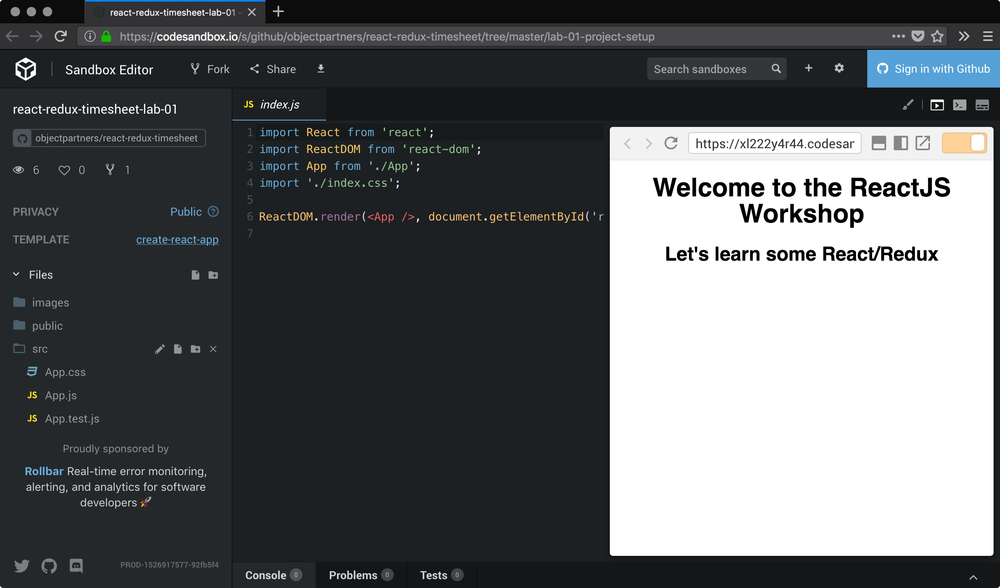
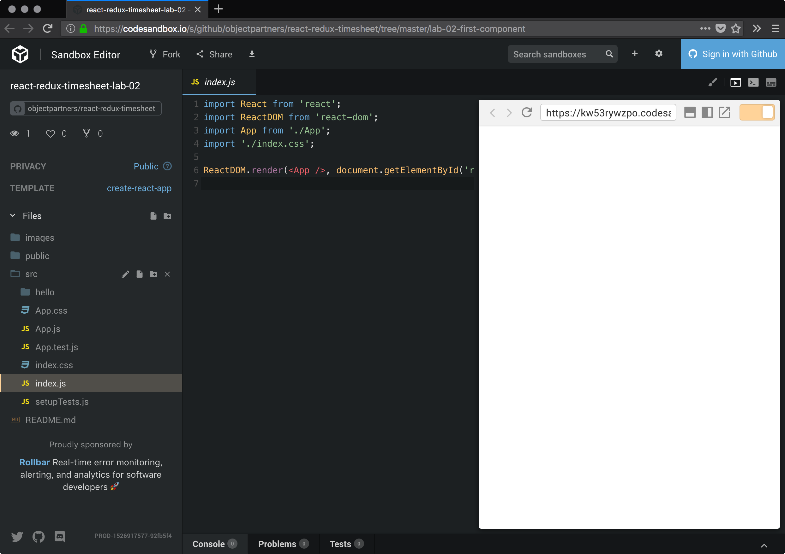
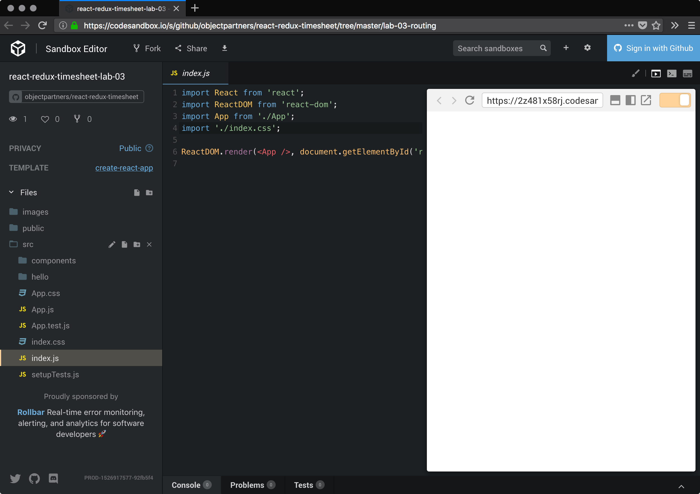
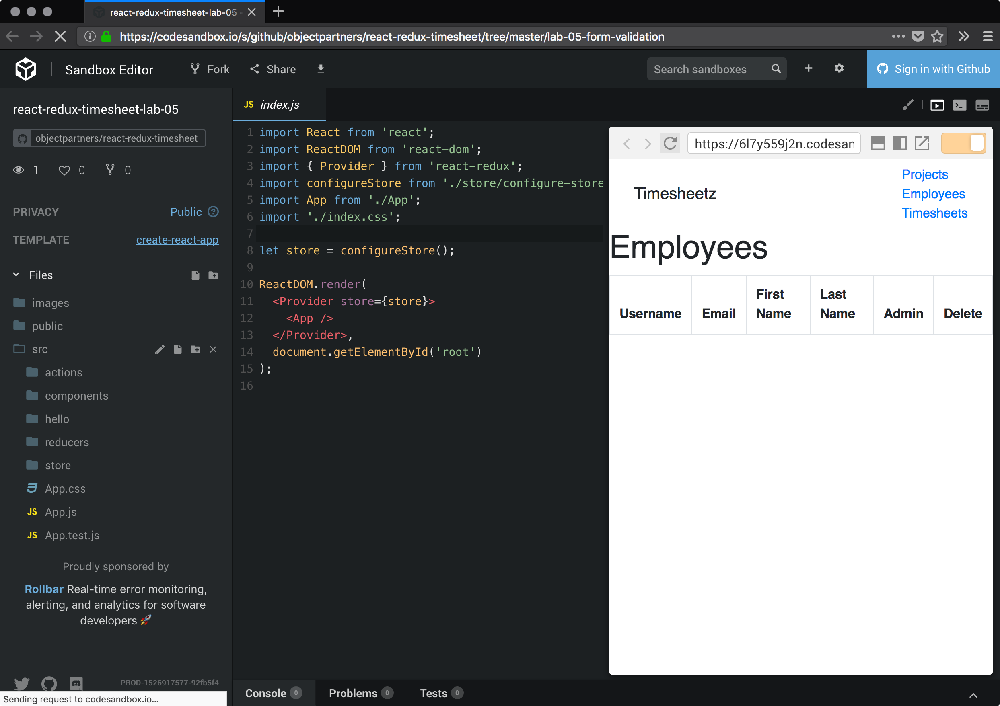

## Code Sandbox

Running into machine issues? NodeJS not configured correctly? `PATH` variable not picking up changes?

Don't fear--we've been there too... more times than we can count!

We've structured our labs so that they can be utilized with a tool called [CodeSandbox][codesandbox], which is essentially an online IDE that works similarly to your local machine setup and allows for similar functionality.

### Customization

Labs 4 and beyond use a Rest API that is assumed to be running locally. For these labs you will need to modify the `package.json` file in each to change the `proxy` entry to the following:

```json:title=package.json
"proxy": "https://timesheets-api-kxhyqqalbh.now.sh"
```

## [Lab 01 - Project Setup][lab-01]

[][lab-01]

## [Lab 02 - First React Component][lab-02]

[][lab-02]

## [Lab 03 - Routing with React Router][lab-03]

[][lab-03]

## [Lab 04 - Redux][lab-04]

[][lab-04]

## [Lab 05 - Form Validation][lab-05]

[][lab-05]

## [Lab 06 - Capstone][lab-06]

[codesandbox]: https://codesandbox.com

[lab-01]: https://codesandbox.io/s/github/objectpartners/react-redux-timesheet/tree/master/lab-01
[lab-02]: https://codesandbox.io/s/github/objectpartners/react-redux-timesheet/tree/master/lab-02
[lab-03]: https://codesandbox.io/s/github/objectpartners/react-redux-timesheet/tree/master/lab-03
[lab-04]: https://codesandbox.io/s/github/objectpartners/react-redux-timesheet/tree/master/lab-04
[lab-05]: https://codesandbox.io/s/github/objectpartners/react-redux-timesheet/tree/master/lab-05
[lab-06]: https://codesandbox.io/s/github/objectpartners/react-redux-timesheet/tree/master/lab-06
