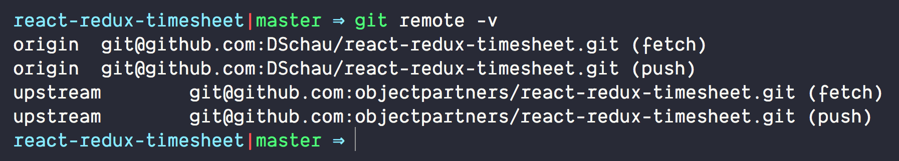

We've made some slight fixes to the labs, so it will be ideal to get your origin/master up to date with upstream/master. This is not _strictly_ required, but will fix some slight issues particularly stylistic issues.

For a refresher on setting upstream, please follow the below instructions:

## Adding upstream repo

If you're feeling extra saucey, we'd also recommend setting up origin and upstream. By default, `origin` will be set to the copy of the cloned fork, but it is often helpful to set upstream to get updates to the upstream project. To set upstream, simply run the following command:

```bash
git remote add upstream https://github.com/objectpartners/react-redux-timesheet.git
```

and then

```bash
git fetch upstream
```

to fetch the latest content in the upstream repository.

To validate, run `git remote -v` and you should see a remote and an origin like the below (perhaps using https instead of ssh)



Please make double sure you're on origin/master with the following command:

```bash
git checkout master
```

## Merging upstream

Once upstream is set, you _should_ now simply be able to merge the changes cleanly from upstream/master with the following command:

```bash
git merge upstream/master
```

If a merge conflict arises, unfortunately the _quickest_ way is to just make your origin/master the same as upstream/master with the following command. Be aware that your local changes will be wiped out (i.e. your lab progress), which is unfortunate, but necessary.

```bash
git reset --hard upstream/master
```

## Running `yarn`

One of the main changes we've made is making our dependency on bootstrap explicit, which means we updated each folder's package.json with a new bootstrap dependency. This means that to pick up this change, you'll want to run `yarn` from the root of the repo (i.e. not within a folder), like so:

```bash
yarn
```

and... you're done and ready to go! Thanks for your patience!!
