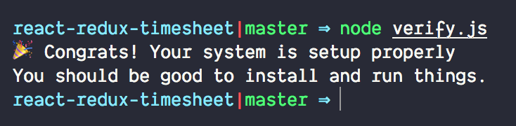

## Setup

Prior to attending the workshop, we ask to validate your machine setup so that we can ensure a smooth workshop focused on learning React, not tweaking machine setup!

1.  Please ensure you have all the requested tooling (e.g. git) as specified in [setup instructions](/labs/setup-and-install-dependencies)
1.  Fork the [react-redux-timesheet repo][react-redux-timesheet]
1.  `git clone https://github.com/yourusername/react-redux-timesheet.git && cd react-redux-timesheet`
1.  `node verify.js`

If all goes well, you should see

[react-redux-timesheet]: https://github.com/objectpartners/react-redux-timesheet.git
