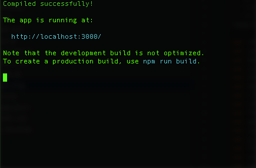
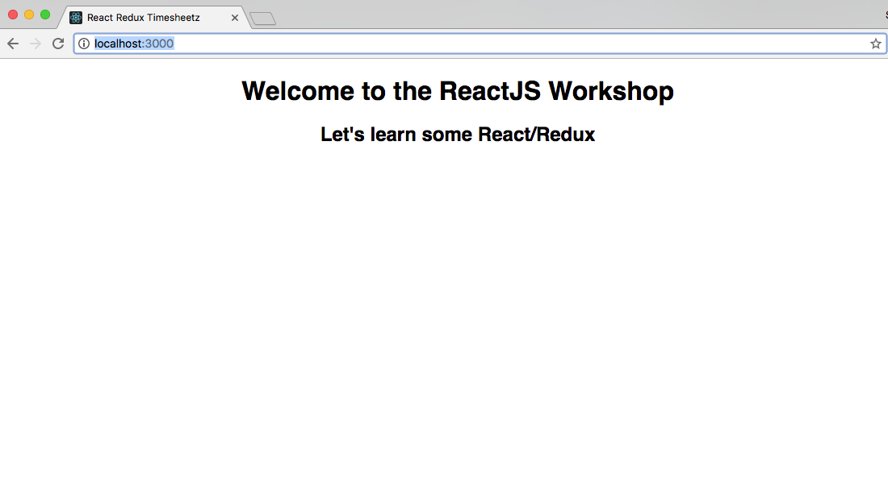

# Lab one - Setup and install dependencies

## Git
Atlassian has a great tutorial for [installing git](https://www.atlassian.com/git/tutorials/install-git) 
in various environments. Below are the quick and easy ways.
#### Windows
Install GitBash using the installer [http://git-scm.com/downloads](http://git-scm.com/downloads) 
or for more full fledged solution, [git for Windows](https://git-for-windows.github.io/) comes with a GUI 
and Windows Explorer integration.

#### Mac
It's probably already installed.
```
$ git --version
git version 2.9.1
```

## Node
Check if you have node installed. `$ node --version`
#### Windows
* Install Node using the installer [https://nodejs.org/download/](https://nodejs.org/download/)
* You may need to install Python 2.7.x+ and Microsoft Visual Studio to build node native libraries. 
    * [https://www.python.org/downloads/](https://www.python.org/downloads/)
    * [https://www.visualstudio.com/downloads/](https://www.visualstudio.com/downloads/)
* Restart
* Open a GitBash terminal
* Update the npm CLI client  ```$ npm install npm --global```

#### Mac
* Install via Homebrew
    * Check for existing install. `$ brew --version`
    * Install Hombrew as needed [http://brew.sh](http://brew.sh)
    * Install Node w/ Hombrew. `$ brew install node`

**NOTE:** If you have errors, try running this first:
```
$ npm config set strict-ssl false
```

## Checkout the Github repository

Checkout project from Github
```
$ git clone https://github.com/objectpartners/react-redux-timesheet.git
```

You should get output similar to below:
```javascript
Cloning into 'react-redux-timesheet'...
remote: Counting objects: 3003, done.
remote: Compressing objects: 100% (1458/1458), done.
remote: Total 3003 (delta 1413), reused 2684 (delta 1256)
Receiving objects: 100% (3003/3003), 1.44 MiB | 1.15 MiB/s, done.
Resolving deltas: 100% (1413/1413), done.
Checking connectivity... done.
```

Change directories to the lab main directory.
```
$ cd react-redux-timesheet
```

Now let's checkout the `lab-01-setup-start` branch.
```
$ git checkout lab-01-project-setup-start
```

## Install the application dependencies

Install the NPM dependencies
```
$ npm install
```

## Start the server

Run the start script
```
$ npm start
```


- This kicks off a Node server and serves up our `index.html` page.

- This is a long running process..it only ends on an error.

- Open your browser and navigate to [http://localhost:3000](http://localhost:3000)

- Verify that you see the welcome page.



#### Now let's check out our project's structure so we know what goes where.
