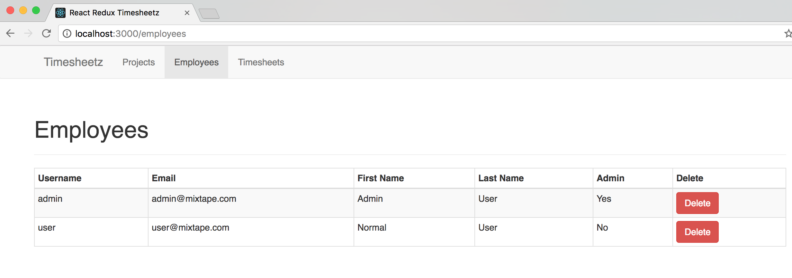
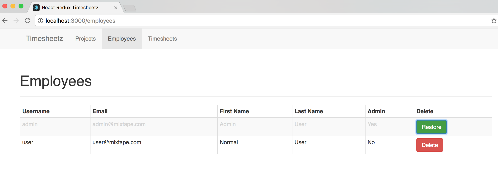

# Lab Four - Adding Flux to the Application

## Checkout the Lab Branch
- In a terminal:

```
git checkout lab-04-redux-start
git pull
```

If not running, start the `npm start` tasks.  Otherwise, restart the running task to pick up any changes in the lab-04-redux-start branch.

&nbsp;
### Check it out!

- Before doing anything, let's look at the progress that has already been completed on the application by the rest of the team.
  - Peruse the **src/components** directory and notice that the **Projects** and **Timesheets** modules have been implemented by the team.
  - Also look at the **actions** and **reducers** directories to get a feel for how these classes are laid out and used.
  - Finally, look at the **src/index.js**, **src/reducers/index.js** and **src/store/configure-store.js** to see how we instantiated Redux and included it in our app.
  - Don't worry if it looks a little cryptic, by the end of this lab, you will understand what is happening.


- What will we do?
  - We will be building our **EmployeeActionCreator** and our **employee-reducer**.
  - Next we will add our reducer to the **rootReducer**  and connect our state and actions to our **Employees** component
  - Then we will update our **Employees** components to use our actions to retrieve our list of employees.
  - Finally, we will update our **EmployeeRow** to delete/restore employees using the actions we created.

&nbsp;
### Create the Employee Action Types
- Open **src/actions/EmployeeActionTypes.js**
- Let's add the constants for the list and get actions.

```javascript
export const LIST = "LIST_EMPLOYEES";
export const GET = "GET_EMPLOYEE";
```

&nbsp;
### Create the Employee Actions
- Now open **src/actions/EmployeeActionCreator.js** so we can create the actions.
- We'll import the types we just created, and the Axios library to handle our http requests.

```javascript
import * as EmployeeActionTypes from './EmployeeActionTypes';
import Axios from 'axios';
```
- Now let's implement the functions that will be used to update the state of our application.

```javascript

export function list(employees) {
  return {
    type: EmployeeActionTypes.LIST,
    employees: employees
  }
}

export function get(employee) {
  return {
    type: EmployeeActionTypes.GET,
    employee: employee
  }
}
```
- Next we'll implement the asynchronous methods that will be used to make our http Requests, along with a helper method to build the url.

```javascript

const apiUrl = '/api/users';

const url = (employeeId) => {

  let url = apiUrl;
  if (employeeId) {
    url += '/' + employeeId;
  }

  return url;
}

export function listEmployees(){
  return function (dispatch) {
    return Axios.get(url())
      .then(response => {
        dispatch(list(response.data));
        console.log('Employees retrieved.');
      })
      .catch(error => {
        console.log('Error attempting to retrieve employees.', error);
      });
  };
}

export const getEmployee = (id) => {
  return (dispatch) => {
    return Axios.get(url(id))
      .then(function (res) {
        dispatch(get(res.data));
        return true;
      })
      .catch(function (x) {
        console.log('There was an error getting the employee');
      });
  }
}

export const updateEmployee = (employee) => {
  return (dispatch) => {
    return Axios.put(url(employee._id), employee)
      .then(function (res) {
        dispatch(get(res.data));
        console.log('Employee : ' + employee.name + ', updated.');
        return true;
      })
      .catch(function (x) {
        console.log('There was an error updating employee.');
      });
  }
}

export const removeEmployee = (employee) => {
  return (dispatch) => {
    employee.deleted = true;

    return Axios.put(url(employee._id), employee)
      .then(function (res) {
        dispatch(get(res.data));
        console.log('Employee : ' + res.data.name + ', was deleted.');
        return true;
      })
      .catch(function (x) {
        console.log('Error attempting to delete employee.');
      });
  }
}

export const restoreEmployee = (employee) => {
  return (dispatch) => {
    employee.deleted = false;

    return Axios.put(url(employee._id), employee)
      .then(function (res) {
        dispatch(get(res.data))
        console.log('Employee : ' + res.data.name + ', was restored.');
        return true;
      })
      .catch(function (x) {
        console.log('Error attempting to restore employee.');
      });
  }
}

export const createEmployee = (employee) => {
  return (dispatch) => {
    return Axios.put(url(), employee)
      .then(function (res) {
        dispatch(get(res.data))
        console.log('Employee : ' + res.data.name + ', created.');
        return true;
      })
      .catch(function (x) {
        console.log('There was an error creating employee.');
      });
  }
}
``` 
- Finally let's test that our functions do what we think they should:
- Open **src/actions/EmployeeActionCreator.test.js** and replace the stubbed out test with the following:

```javascript
import configureMockStore from 'redux-mock-store'
import thunk from 'redux-thunk'
import * as actions from './EmployeeActionCreator'
import * as types from './EmployeeActionTypes'
import moxios from 'moxios'

const middlewares = [ thunk ]
const mockStore = configureMockStore(middlewares)

describe('synchronous actions', () => {
  it('list should send objects', () =>{
    expect(
      actions.list(['p1', 'p2'])
    ).toEqual(
      {
        type: types.LIST,
        employees: ['p1', 'p2']
      }
    )
  });

  it('get should send object', () =>{
    expect(
      actions.get('p1')
    ).toEqual(
      {
        type: types.GET,
        employee: 'p1'
      }
    )
  });
});

describe('async actions', () => {
  beforeEach(function () {
    moxios.install()
  });

  afterEach(function () {
    moxios.uninstall()
  });

  it('creates LIST when fetching employees has been done', () => {
    moxios.stubRequest('/api/users', {
      status: 200,
      response: ['employee1', 'employee2']
    });


    const expectedActions = [
      {type: types.LIST, employees: ['employee1', 'employee2']}
    ]
    const store = mockStore({employees: []})

    return store.dispatch(actions.listEmployees())
      .then(() => { // return of async actions
        expect(store.getActions()).toEqual(expectedActions)
      })
  });


  it('create GET when requesting single employee', () => {
    moxios.stubRequest('/api/users/1', {
      status: 200,
      response: 'employee1'
    });


    const expectedActions = [
      {type: types.GET, employee: 'employee1'}
    ]
    const store = mockStore({employees: []})

    return store.dispatch(actions.getEmployee(1))
      .then(() => { // return of async actions
        expect(store.getActions()).toEqual(expectedActions)
      })

  });


  it('create GET when updating a employee', () => {
    moxios.stubRequest('/api/users/1', {
      status: 200,
      response: 'employee1'
    });

    const expectedActions = [
      {type: types.GET, employee: 'employee1'}
    ]
    const store = mockStore({employees: []})

    return store.dispatch(actions.updateEmployee({_id: 1}))
      .then(() => { // return of async actions
        expect(store.getActions()).toEqual(expectedActions)
      })

  });

  it('create GET when removing a employee', () => {
    moxios.stubRequest('/api/users/1', {
      status: 200,
      response: 'employee1'
    });

    const expectedActions = [
      {type: types.GET, employee: 'employee1'}
    ]
    const store = mockStore({employees: []})

    return store.dispatch(actions.removeEmployee({_id: 1}))
      .then(() => { // return of async actions
        expect(store.getActions()).toEqual(expectedActions)
      })

  });

  it('create GET when restoring a employee', () => {
    moxios.stubRequest('/api/users/1', {
      status: 200,
      response: 'employee1'
    });

    const expectedActions = [
      {type: types.GET, employee: 'employee1'}
    ]
    const store = mockStore({employees: []})

    return store.dispatch(actions.restoreEmployee({_id: 1}))
      .then(() => { // return of async actions
        expect(store.getActions()).toEqual(expectedActions)
      })

  });
});
```

- Let's take a look at what we are doing here.
	- First we're testing that the synchronous actions are creating packets of type LIST and GET.
	- Then in the asynchronous tests we are using **moxios** to http response for our **axois** requests, and we're using the **redux-mock-store**'s **configureMockStore** to mock our redux store so we can dispatch or actions and test them.
	- Finally, we are using those mocks to see that the asynch actions generate the packets we expect when dispatched.

- Make sure the tests pass and move on to the next section.

&nbsp;
### Create the Reducer

- Open **src/reducers/employee-reducer.js**
- Import the action types we created earlier and implement the reducing function.

```javascript
import * as EmployeeActionTypes from '../actions/EmployeeActionTypes';

export default (state = {employees: [], employee: {}}, action) => {
  switch (action.type) {
    case EmployeeActionTypes.LIST:
      return Object.assign({}, state, {employees: action.employees});
    case EmployeeActionTypes.GET:
      return Object.assign({}, state, {employee: action.employee});

    default:
      return state;
  }
}
```

- Now let's add our **employee-reducer** to the combined reducer
- Open **src/reducers/index.js**
- Import the **employee-reducer**

```javascript
import employees from './employee-reducer';

```


- Add it to the list or reducers so it looks like this:

```javascript
const rootReducer = combineReducers({
  projects: projects,
  timesheets: timesheets,
  employees: employees
});
```

&nbsp;
### Use the Employee Actions

- Now, let's update our **Employee** components to use these actions.
- Open **src/components/Employees.js**
- Import some **redux** libraries we need and the **EmployeeActionCreator**

```javascript
import { bindActionCreators } from 'redux';
import { connect } from 'react-redux';
import * as EmployeeActions from '../../actions/EmployeeActionCreator';
```

- Next lets add the **mapStateToProps** and **mapDispatchToProps** methods between the componenet and the export.

```javascript
function mapStateToProps(state) {
  return {
    employees: state.employees.employees
  }
}

function mapDispatchToProps(dispatch) {
  return {
    actions: bindActionCreators(EmployeeActions, dispatch)
  };
}
```

- Then we'll replace the export with one that **connect** those methods to the componenet using the **redux** method we imported above

```javascript
export default connect(
  mapStateToProps,
  mapDispatchToProps
)(Employees);
```

- Next, we can replace the constructor with the hardcoded data with one that call the **listEmployees** action.

```javascript
  constructor(props) {
    super(props);
    props.actions.listEmployees();
  }
```  
- Now we update the data we are passing to the EmployeeTable in the render method.

```javascript
<EmployeeTable employees={this.props.employees} actions={this.props.actions}/>
```

- Next let's open the **src/components/employees/EmployeeTable.js** and update the render method to pass the actions to the **EmployeeRows**

```javascript
    const actions = this.props.actions;
    
    let employeeRows = this.props.employees.map(function (employee) {
      return (
        <EmployeeRow employee={employee} key={++key} actions={actions} />
      );
    });
``` 
- Then we need to add a column header for the delete button we'll add to the **EmployeeRow**

```javascript
<th>Delete</th>
```
- Now let's open the **src/components/employees/EmployeeRow.js** and the delete functionality by
	- Importing the bootstrap **Button** component
	- Styling the deleted rows
	- Building the button
	- Rendering the button
- The final file should look like this:  

```javascript
import React, { Component } from 'react';
import {Button} from 'react-bootstrap';

class EmployeeRow extends Component {

  handleClick(employee) {
    if(employee.deleted){
      employee.deleted = false;
      this.props.actions.restoreEmployee(employee).then(this.props.actions.listEmployees);
    }
    else{
      employee.deleted = true;
      this.props.actions.removeEmployee(employee).then(this.props.actions.listEmployees);
    }
  }

  render() {
    const employee = this.props.employee;

    let rowClass = "";
    if(employee.deleted){
      rowClass = "faded";
    }

    const button = (
      <Button
        onClick={() => {this.handleClick(employee)}}
        bsStyle={employee.deleted ? 'success' : 'danger'}
      >
        {employee.deleted ? 'Restore' : 'Delete'}
      </Button>);


    return (
      <tr className={rowClass}>
        <td>{employee.username}</td>
        <td>{employee.email}</td>
        <td>{employee.firstName}</td>
        <td>{employee.lastName}</td>
        <td>{employee.admin ? 'Yes' : 'No'}</td>
        <td>{button}</td>
      </tr>
    );
  }

}

EmployeeRow.propTypes = {
  employee: React.PropTypes.object.isRequired
};

export default EmployeeRow;
```
>Note: Check out how we can build that **button** variable as jsx and include it in our render method.
   
&nbsp;
## Run the application and see your work.

If you haven't already done so,
- In a terminal windows run: `npm start` to fire off the build.
- Navigate to [http://localhost:3000](http://localhost:3000) in your favorite browser.

- Click around and enjoy the result of your hard work during this lab.



- How 'bout that delete!



&nbsp;
### Commit your changes to Git and get ready for the next lab.

```
git add .
git commit -m 'Redux is in full effect'
```
